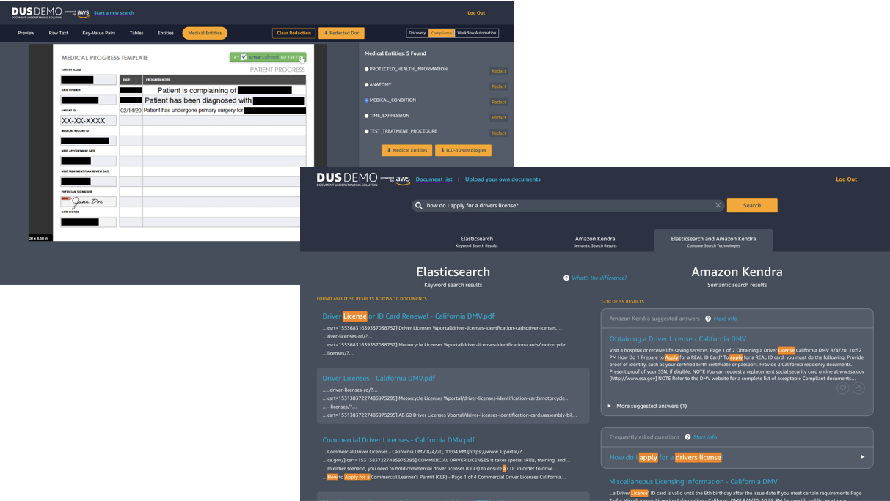
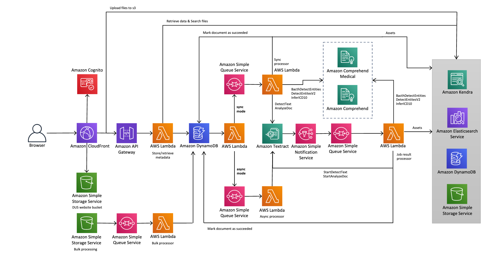

# Document Understanding Solution

DUS leverages the power of Amazon Textract, Amazon Comprehend , Amazon Comprehend Medical Amazon Elasticsearch and Amazon Kendra to provide digitization , domain-specific data discovery, redaction controls , structural component extraction and other document processing & understanding capaibilities.



## Architecture Diagram



### Note

Current document formats supported : **PDF,JPG,PNG**

Current maximum document file size supported : **150MB**

Current concurrent document uploads (via UI ) supported : **100**

## 1. CICD Deploy

### Requirements

- aws cli

  `sudo yum -y install aws-cli`

- pip3 (Required to install packages)

  `curl https://bootstrap.pypa.io/get-pip.py -o get-pip.py && python3 get-pip.py`

### Getting Started with CICD Deploy

- Create a bucket to act as the target Amazon S3 distribution bucket

_Note:_ You will have to create an S3 bucket with the template 'my-bucket-name-<aws_region>'; aws_region is where you are testing the customized solution.

For example, you create a bucket called `my-solutions-bucket-us-east-1`,

- Now build the distributable:

```
chmod +x ./deployment/build-s3-dist.sh
./deployment/build-s3-dist.sh <bucket-name-minus-region> <solution-name> <version>
```

For example,

```
./deployment/build-s3-dist.sh my-solutions-bucket document-understanding-solution v1.0.0
```

- Deploy the distributable to an Amazon S3 bucket in your account. _Note:_ you must have the AWS Command Line Interface installed.

```
aws s3 cp ./deployment/global-s3-assets/ s3://my-bucket-name-<aws_region>/<solution_name>/<my-version>/ --recursive --acl bucket-owner-full-control --profile aws-cred-profile-name
aws s3 cp ./deployment/regional-s3-assets/ s3://my-bucket-name-<aws_region>/<solution_name>/<my-version>/ --recursive --acl bucket-owner-full-control --profile aws-cred-profile-name
```

- Get the link of the document-understanding-solution.template uploaded to your Amazon S3 bucket.
- Deploy the Document Understanding solution to your account by launching a new AWS CloudFormation stack using the link of the document-understanding-solution.template.
- If you wish to manually choose whether to enable Kendra or Read-only mode (default 'true' and 'false', respectively), you need to add `ParameterKey=KendraEnabled,ParameterValue=<true_or_false>` `ParameterKey=ComprehendMedicalEnabled,ParameterValue=<true_or_false>` and `ParameterKey=ReadOnlyMode,ParameterValue=<true_or_false>` after the email parameter when calling `create-stack`.

```
aws cloudformation create-stack --stack-name DocumentUnderstandingSolutionCICD --template-url https://my-bucket-name-<aws_region>.s3.amazonaws.com/<solution_name>/<my_version>/document-understanding-solution.template --parameters ParameterKey=Email,ParameterValue=<my_email> --capabilities CAPABILITY_NAMED_IAM --disable-rollback
```

This solutions will create 7 S3 buckets that need to be manually deleted when the stack is destroyed (Cloudformation will only delete the solution specific CDK toolkit bucket. The rest are preserved to prevent accidental data loss).

- 2 for CICD
- 1 for solution specific CDK Toolkit
- 2/3 for documents ((sample and general documents and optionally 1 for Medical sample documents if opting for Amazon Kendra Integration)
- 1 for the client bucket
- 1 for access logs
- 1 for CDK toolkit (if this is the customer's first try with CDK)
- 1 for document bulk processing pipeline

The solution is set up to reserve lambda concurrency quota. This is both to limit the scale of concurrent Lambda invocations as well to ensure sufficient capacity is available for the smooth functioning of the demo. You can tweak the "API_CONCURRENT_REQUESTS" value in source/lib/cdk-textract-stack.ts for changing the concurrency Lambda limits

### Notes

- Do NOT change the `cicd` in package.json. This field is for the deployment system to use in CodePipeline
- Due to limitations of CodeCommit, you cannot use this deploy approach if you add a file to the solution that is above 6MB (for good measure, stay below 5MB)

## Development Deploy

The instructions below cover installation on Unix-based Operating systems like macOS and Linux.
You can use a AWS Cloud9 enviornment or EC2 instance (recommended: t3.large or higher on Amazon Linux platform) to deploy the solution

### Requirements

Please ensure you install all requirements before beginning the deployment

- aws cli

  `sudo yum -y install aws-cli`

- node 10+

  `sudo yum -y install nodejs`

- yarn

  `curl --silent --location https://dl.yarnpkg.com/rpm/yarn.repo | sudo tee /etc/yum.repos.d/yarn.repo`

  `sudo yum -y install yarn`

- tsc

  `npm install -g typescript`

- jq

  `sudo yum -y install jq`

- moto (Required for running the tests)
  `pip install moto==1.3.14`

- pip3 (Required to install packages)
  `curl https://bootstrap.pypa.io/get-pip.py -o get-pip.py && python3 get-pip.py`

To deploy using this approach, you must first set few values inside the `package.json` file in the `source` folder.

- Set your deployment region in the `stack->region` property, replacing `"%%REGION%%"`. This deployment will not pull the AWS region from your current AWS profile.

  _Note_ : The AWS services used in this solution are not all available in all AWS Regions. Supported regions include us-east-1,us-west-2,eu-west-1. Please refer the [AWS Regions Table](https://aws.amazon.com/about-aws/global-infrastructure/regional-product-services/) for the most up to date information on which regions support the all services in DUS are available.

- Enter your email into the `email` property, replacing `"%%USER_EMAIL%%"`
- If you want to use the [Classic mode](#classic-mode), set the enableKendra flag to `false`. For [Kendra-enabled mode](#kendra-enabled-mode), set the flag as `true`
- If you want to use the [Read-only (RO) mode](#read-only-mode), set the is isROMode flag to `true`.

Now switch to the source directory, and use yarn to deploy the solution:

```
cd ./source
```

```
yarn && yarn deploy
```

The cli will prompt for approval on IAM Roles and Permissions twice in the full deploy. Once for the backend stack and then again for the client stack. The cli will prompt for an email. After the deploy is complete, an email will be sent to address provided with credentials for logging in.

Note:

This will create 5 or 6 S3 buckets that will have to be manually deleted when the stack is destroyed (Cloudformation does not delete them, in order to avoid data loss).

- 2/3 for documents (sample and general documents and optionally 1 for Medical sample documents if opting for Amazon Kendra Integration)
- 1 for the client stack
- 1 for document bulk processing pipeline
- 1 for CDK toolkit (if this is your first time using CDK)

The solution is set up to reserve lambda concurrency quota. This is both to limit the scale of concurrent Lambda invocations as well to ensure sufficient capacity is available for the smooth functioning of the demo. You can tweak the "API_CONCURRENT_REQUESTS" value in source/lib/cdk-textract-stack.ts for changing the concurrency Lambda limits

### Development Deploy Commands

- `yarn deploy:backend` : deploys or updates the backend stack
- `yarn deploy:client` : deploys or updates the client app
- `yarn deploy:setup-samples` : push sample docs to s3
- `yarn deploy:setup-user` : initiated prompts to set up a user
- `yarn deploy:show` : displays the url of the client app
- `yarn destroy` : tears down the CloudFormation backend and client stacks

### Development Deploy Workflow and stacknaming

The `package.json` script node `stackname` sets the stackname for the deploy commands. Throughout development it has been imperative to maintain multiple stacks in order to allow client app development and stack architecture development to work without creating breaking changes. When a new stackname is merged into develop it should have the most up to date deployments.

### Developing Locally

Once deployed into the AWS account, you can also deploy locally for web development
This application uses [next.js](https://github.com/zeit/next.js/) along with [next-scss](https://github.com/zeit/next-plugins/tree/master/packages/next-sass) — all documentation for those packages apply here. NOTE: This application uses the static export feature of next.js — be aware of the limited features available when using static export.

#### Start Dev Server

- Clone this repository
- Run `yarn` to install/update packages
- Run `yarn dev`
- Navigate to http://localhost:3000
- NOTE: The dev build is noticeably slower than the production build because pages are built/unbuilt on-demand. Also, the code in the dev build is uncompressed and includes extra code for debugging purposes.

#### Generate Production Build

- Run `yarn export` to create a static export of the application.
- In a terminal go to the `app/out` directory and run `python -m SimpleHTTPServer`
- Navigate to http://localhost:8000

### Code Quality Tools

This project uses [Prettier](https://prettier.io) to format code. It is recommended to install a [Prettier extension for your editor](https://prettier.io/docs/en/editors.html) and configure it to format on save. You can also run `yarn prettier` to auto-format all files in the project (make sure you do this on a clean working copy so you only commit formatting changes).

This project also uses ESLint and sass-lint to help find bugs and enforce code quality/consistency. Run `yarn lint:js` to run ESLint. Run `yarn lint:css` to run sass-lint. Run `yarn lint` to run them both.

### Generating License Report

Run `yarn license-report` to generate a license report for all npm packages. See output in `license-report.txt`.

## DUS Modes:

### Classic Mode

This is first release of the DUS solution. The major services included in this mode include Amazon Elasticsearch, Amazon Textract and Amazon Comprehend that allow digitization, information extraction and indexing in DUS.

### Comprehend Medical Enabled Mode
In comprehend medical mode, DUS provides the capability to extract medical information in the documents in addition to the capabilities of the classic mode.
To enable this mode, set the ` enableComprehendMedical: "true"` in package.json

### Kendra-Enabled Mode

In the Classic version, DUS supports searching/indexing of documents using Amazon Elasticsearch
In the kendra enabled mode, Amazon Kendra is added as an additional capability and can be used for exploring features such as Semantic Search, Adding FAQs and Access Control Lists.
Simply set the ` enableKendra: "true"` in package.json
_Note:_ Amazon Kendra Developer edition is deployed as a part of this deployment.

### Read-Only Mode

In this mode, DUS will only be available in Read-Only mode and you will only be able to analyze the pre-loaded documents. You will not be able to upload documents from the web application UI. In order to enable the Read-Only mode, set ` isROMode: "true"` in package.json. By default, this mode is disabled.

## Notes

### Document Bulk Processing

DUS supports bulk processing of documents. During deploy, an S3 bucket for document bulk processing is created. To use the bulk processing mode, simply upload documents under the `documentDrop/` prefix.
In Kendra mode, you can also upload the corresponding access control list under `policy/` prefix in the same bucket with the following name convention _\<document-name>\.metadata.json_ Be sure to upload the access control policy first and then the document.

### Other

- To switch between the DUS Classic version and Amazon Kendra enabled version, please follow a fresh deploy (either in a different region/ deleting the stack) and avoid updating the CloudFormation stack for the existing mode. Currently, DUS does not have the feature to seamlessly switch between the 2 modes.
  More info available in this [issue](https://github.com/awslabs/document-understanding-solution/issues/83)
- Do NOT change the `cicd` in package.json. This field is for the deployment system to use in CodePipeline
- Due to limitations of CodeCommit, you cannot use this deploy approach if you add a file to the solution that is above 6MB (for good measure, stay below 5MB)

## Cost

- As you deploy this sample application, it creates different resources (Amazon S3 bucket, Amazon SQS Queue, Amazon DynamoDB table, Elasticsearch (and potenitally Amazon Kendra) clsuter(s) and AWS Lambda functions etc.). When you analyze documents, it calls different APIs (Amazon Textract , Amazon Comprehend and Amazon Comprehend Medical) in your AWS account. You will get charged for all the API calls made as part of the analysis as well as any AWS resources created as part of the deployment. To avoid any recurring charges, delete stack using "yarn destroy".

- The CDK Toolkit stacks that are created during deploy of this solution are not destroyed when you tear down the solution stacks. If you want to remove these resources, delete the S3 bucket that contains `staging-bucket` in the name, and then delete the `CDKToolkit` stack.

- You are responsible for the cost of the AWS services used while running this reference
  deployment. The solution consists of some resources that have to be paid by the hour/size
  such as Amazon Elasticsearch, Amazon Kendra and Amazon S3 while others are serverless technologies where
  costs are incurred depending on the number of requests.
  The approximate cost for the solution for 100 documents/day comes under $20/day for the Classic Mode and under $80/day for Kendra-Enabled Mode. For accurate and most up-to-date pricing information, refer [AWS Pricing](https://aws.amazon.com/pricing/)

## Delete demo application

1. CICD Deploy:

Either run `aws cloudformation delete-stack --stack-name {CICD stack}`, or go to Cloudformation in the AWS Console and delete the stack that ends with "CICD". You will also have to go to CodeCommit in the console and manually delete the Repository that was created during the deploy.

2. Development Deploy:

Make sure you are in the `source` directory, and then run `yarn destroy`.

## License

This project is licensed under the Apache-2.0 License.
You may not use this file except in compliance with the License. A copy of the License is located at
http://www.apache.org/licenses/

## Additional Notes

The intended use is for users to use this application as a reference architecture to build production ready systems for their use cases. Users will deploy this solution in their own AWS accounts and own the deployment, maintenance and updates of their applications based on this solution.

Unless required by applicable law or agreed to in writing, software distributed under the License is distributed on an "AS IS" BASIS, WITHOUT WARRANTIES OR CONDITIONS OF ANY KIND, either express or implied. See the License for the specific language governing permissions and limitations under the License.

The searchable PDF functionality is inluded as a pre-compiled jar binary. See the following README for more information: `source/lambda/pdfgenerator/README.md`
